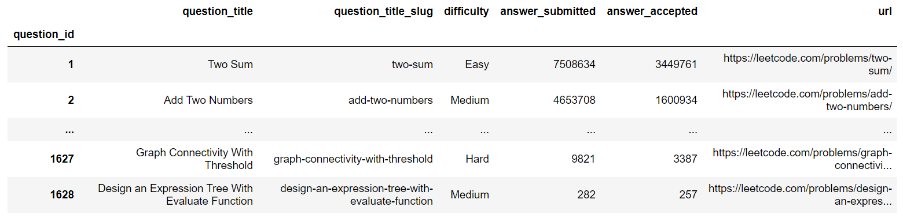

# [leetcode](https://leetcode.com/problemset/all/)

Repository containing Python solutions to LeetCode problems. The focal point of this project is to try to provide solutions as minimalist and as clean as possible.

| # | Title | Solution | Difficulty |
|---| ----- | -------- | ---------- |
|1|[Two Sum](https://leetcode.com/problems/two-sum/)|[Python](solutions/1-two-sum.py)|Easy|
|2|[Add Two Numbers](https://leetcode.com/problems/add-two-numbers/)|[Python](solutions/2-add-two-numbers.py)|Medium|
|3|[Longest Substring Without Repeating Characters](https://leetcode.com/problems/longest-substring-without-repeating-characters/)|[Python](solutions/3-longest-substring-without-repeating-characters.py)|Medium|
|4|[Median of Two Sorted Arrays](https://leetcode.com/problems/median-of-two-sorted-arrays/)|[Python](solutions/4-median-of-two-sorted-arrays.py)|Hard|
|5|[Longest Palindromic Substring](https://leetcode.com/problems/longest-palindromic-substring/)|[Python](solutions/5-longest-palindromic-substring.py)|Medium|
|6|[ZigZag Conversion](https://leetcode.com/problems/zigzag-conversion/)|[Python](solutions/6-zigzag-conversion.py)|Medium|
|7|[Reverse Integer](https://leetcode.com/problems/reverse-integer/)|[Python](solutions/7-reverse-integer.py)|Easy|
|8|[String to Integer (atoi)](https://leetcode.com/problems/string-to-integer-atoi/)|[Python](solutions/8-string-to-integer-atoi.py)|Medium|
|9|[Palindrome Number](https://leetcode.com/problems/palindrome-number/)|[Python](solutions/9-palindrome-number.py)|Easy|
|10|[Regular Expression Matching](https://leetcode.com/problems/regular-expression-matching/)|[Python](solutions/10-regular-expression-matching.py)|Hard|
|11|[Container With Most Water](https://leetcode.com/problems/container-with-most-water/)|[Python](solutions/11-container-with-most-water.py)|Medium|
|12|[Integer to Roman](https://leetcode.com/problems/integer-to-roman/)|[Python](solutions/12-integer-to-roman.py)|Medium|
|13|[Roman to Integer](https://leetcode.com/problems/roman-to-integer/)|[Python](solutions/13-roman-to-integer.py)|Easy|
|14|[Longest Common Prefix](https://leetcode.com/problems/longest-common-prefix/)|[Python](solutions/14-longest-common-prefix.py)|Easy|
|16|[3Sum Closest](https://leetcode.com/problems/3sum-closest/)|[Python](solutions/16-3sum-closest.py)|Medium|
|17|[Letter Combinations of a Phone Number](https://leetcode.com/problems/letter-combinations-of-a-phone-number/)|[Python](solutions/17-letter-combinations-of-a-phone-number.py)|Medium|
|18|[4Sum](https://leetcode.com/problems/4sum/)|[Python](solutions/18-4sum.py)|Medium|
|19|[Remove Nth Node From End of List](https://leetcode.com/problems/remove-nth-node-from-end-of-list/)|[Python](solutions/19-remove-nth-node-from-end-of-list.py)|Medium|
|20|[Valid Parentheses](https://leetcode.com/problems/valid-parentheses/)|[Python](solutions/20-valid-parentheses.py)|Easy|
|23|[Merge k Sorted Lists](https://leetcode.com/problems/merge-k-sorted-lists/)|[Python](solutions/23-merge-k-sorted-lists.py)|Hard|
|24|[Swap Nodes in Pairs](https://leetcode.com/problems/swap-nodes-in-pairs/)|[Python](solutions/24-swap-nodes-in-pairs.py)|Medium|
|25|[Reverse Nodes in k-Group](https://leetcode.com/problems/reverse-nodes-in-k-group/)|[Python](solutions/25-reverse-nodes-in-k-group.py)|Hard|
|26|[Remove Duplicates from Sorted Array](https://leetcode.com/problems/remove-duplicates-from-sorted-array/)|[Python](solutions/26-remove-duplicates-from-sorted-array.py)|Easy|
|27|[Remove Element](https://leetcode.com/problems/remove-element/)|[Python](solutions/27-remove-element.py)|Easy|
|28|[Implement strStr()](https://leetcode.com/problems/implement-strstr/)|[Python](solutions/28-implement-strstr.py)|Easy|
|29|[Divide Two Integers](https://leetcode.com/problems/divide-two-integers/)|[Python](solutions/29-divide-two-integers.py)|Medium|
|33|[Search in Rotated Sorted Array](https://leetcode.com/problems/search-in-rotated-sorted-array/)|[Python](solutions/33-search-in-rotated-sorted-array.py)|Medium|
|34|[Find First and Last Position of Element in Sorted Array](https://leetcode.com/problems/find-first-and-last-position-of-element-in-sorted-array/)|[Python](solutions/34-find-first-and-last-position-of-element-in-sorted-array.py)|Medium|
|35|[Search Insert Position](https://leetcode.com/problems/search-insert-position/)|[Python](solutions/35-search-insert-position.py)|Easy|
|36|[Valid Sudoku](https://leetcode.com/problems/valid-sudoku/)|[Python](solutions/36-valid-sudoku.py)|Medium|
|38|[Count and Say](https://leetcode.com/problems/count-and-say/)|[Python](solutions/38-count-and-say.py)|Medium|
|39|[Combination Sum](https://leetcode.com/problems/combination-sum/)|[Python](solutions/39-combination-sum.py)|Medium|
|41|[First Missing Positive](https://leetcode.com/problems/first-missing-positive/)|[Python](solutions/41-first-missing-positive.py)|Hard|
|42|[Trapping Rain Water](https://leetcode.com/problems/trapping-rain-water/)|[Python](solutions/42-trapping-rain-water.py)|Hard|
|43|[Multiply Strings](https://leetcode.com/problems/multiply-strings/)|[Python](solutions/43-multiply-strings.py)|Medium|
|45|[Jump Game II](https://leetcode.com/problems/jump-game-ii/)|[Python](solutions/45-jump-game-ii.py)|Medium|
|48|[Rotate Image](https://leetcode.com/problems/rotate-image/)|[Python](solutions/48-rotate-image.py)|Medium|
|53|[Maximum Subarray](https://leetcode.com/problems/maximum-subarray/)|[Python](solutions/53-maximum-subarray.py)|Easy|
|54|[Spiral Matrix](https://leetcode.com/problems/spiral-matrix/)|[Python](solutions/54-spiral-matrix.py)|Medium|
|55|[Jump Game](https://leetcode.com/problems/jump-game/)|[Python](solutions/55-jump-game.py)|Medium|
|56|[Merge Intervals](https://leetcode.com/problems/merge-intervals/)|[Python](solutions/56-merge-intervals.py)|Medium|
|57|[Insert Interval](https://leetcode.com/problems/insert-interval/)|[Python](solutions/57-insert-interval.py)|Medium|
|58|[Length of Last Word](https://leetcode.com/problems/length-of-last-word/)|[Python](solutions/58-length-of-last-word.py)|Easy|
|64|[Minimum Path Sum](https://leetcode.com/problems/minimum-path-sum/)|[Python](solutions/64-minimum-path-sum.py)|Medium|
|66|[Plus One](https://leetcode.com/problems/plus-one/)|[Python](solutions/66-plus-one.py)|Easy|
|67|[Add Binary](https://leetcode.com/problems/add-binary/)|[Python](solutions/67-add-binary.py)|Easy|
|70|[Climbing Stairs](https://leetcode.com/problems/climbing-stairs/)|[Python](solutions/70-climbing-stairs.py)|Easy|
|76|[Minimum Window Substring](https://leetcode.com/problems/minimum-window-substring/)|[Python](solutions/76-minimum-window-substring.py)|Hard|
|78|[Subsets](https://leetcode.com/problems/subsets/)|[Python](solutions/78-subsets.py)|Medium|
|104|[Maximum Depth of Binary Tree](https://leetcode.com/problems/maximum-depth-of-binary-tree/)|[Python](solutions/104-maximum-depth-of-binary-tree.py)|Easy|
|121|[Best Time to Buy and Sell Stock](https://leetcode.com/problems/best-time-to-buy-and-sell-stock/)|[Python](solutions/121-best-time-to-buy-and-sell-stock.py)|Easy|
|122|[Best Time to Buy and Sell Stock II](https://leetcode.com/problems/best-time-to-buy-and-sell-stock-ii/)|[Python](solutions/122-best-time-to-buy-and-sell-stock-ii.py)|Easy|
|136|[Single Number](https://leetcode.com/problems/single-number/)|[Python](solutions/136-single-number.py)|Easy|
|155|[Min Stack](https://leetcode.com/problems/min-stack/)|[Python](solutions/155-min-stack.py)|Easy|
|169|[Majority Element](https://leetcode.com/problems/majority-element/)|[Python](solutions/169-majority-element.py)|Easy|
|179|[Largest Number](https://leetcode.com/problems/largest-number/)|[Python](solutions/179-largest-number.py)|Medium|
|189|[Rotate Array](https://leetcode.com/problems/rotate-array/)|[Python](solutions/189-rotate-array.py)|Medium|
|202|[Happy Number](https://leetcode.com/problems/happy-number/)|[Python](solutions/202-happy-number.py)|Easy|
|206|[Reverse Linked List](https://leetcode.com/problems/reverse-linked-list/)|[Python](solutions/206-reverse-linked-list.py)|Easy|
|226|[Invert Binary Tree](https://leetcode.com/problems/invert-binary-tree/)|[Python](solutions/226-invert-binary-tree.py)|Easy|
|227|[Basic Calculator II](https://leetcode.com/problems/basic-calculator-ii/)|[Python](solutions/227-basic-calculator-ii.py)|Medium|
|237|[Delete Node in a Linked List](https://leetcode.com/problems/delete-node-in-a-linked-list/)|[Python](solutions/237-delete-node-in-a-linked-list.py)|Easy|
|279|[Perfect Squares](https://leetcode.com/problems/perfect-squares/)|[Python](solutions/279-perfect-squares.py)|Medium|
|283|[Move Zeroes](https://leetcode.com/problems/move-zeroes/)|[Python](solutions/283-move-zeroes.py)|Easy|
|303|[Range Sum Query - Immutable](https://leetcode.com/problems/range-sum-query-immutable/)|[Python](solutions/303-range-sum-query-immutable.py)|Easy|
|322|[Coin Change](https://leetcode.com/problems/coin-change/)|[Python](solutions/322-coin-change.py)|Medium|
|338|[Counting Bits](https://leetcode.com/problems/counting-bits/)|[Python](solutions/338-counting-bits.py)|Medium|
|344|[Reverse String](https://leetcode.com/problems/reverse-string/)|[Python](solutions/344-reverse-string.py)|Easy|
|347|[Top K Frequent Elements](https://leetcode.com/problems/top-k-frequent-elements/)|[Python](solutions/347-top-k-frequent-elements.py)|Medium|
|405|[Convert a Number to Hexadecimal](https://leetcode.com/problems/convert-a-number-to-hexadecimal/)|[Python](solutions/405-convert-a-number-to-hexadecimal.py)|Easy|
|406|[Queue Reconstruction by Height](https://leetcode.com/problems/queue-reconstruction-by-height/)|[Python](solutions/406-queue-reconstruction-by-height.py)|Medium|
|478|[Generate Random Point in a Circle](https://leetcode.com/problems/generate-random-point-in-a-circle/)|[Python](solutions/478-generate-random-point-in-a-circle.py)|Medium|
|509|[Fibonacci Number](https://leetcode.com/problems/fibonacci-number/)|[Python](solutions/509-fibonacci-number.py)|Easy|
|516|[Longest Palindromic Subsequence](https://leetcode.com/problems/longest-palindromic-subsequence/)|[Python](solutions/516-longest-palindromic-subsequence.py)|Medium|
|581|[Shortest Unsorted Continuous Subarray](https://leetcode.com/problems/shortest-unsorted-continuous-subarray/)|[Python](solutions/581-shortest-unsorted-continuous-subarray.py)|Medium|
|617|[Merge Two Binary Trees](https://leetcode.com/problems/merge-two-binary-trees/)|[Python](solutions/617-merge-two-binary-trees.py)|Easy|
|621|[Task Scheduler](https://leetcode.com/problems/task-scheduler/)|[Python](solutions/621-task-scheduler.py)|Medium|
|628|[Maximum Product of Three Numbers](https://leetcode.com/problems/maximum-product-of-three-numbers/)|[Python](solutions/628-maximum-product-of-three-numbers.py)|Easy|
|659|[Split Array into Consecutive Subsequences](https://leetcode.com/problems/split-array-into-consecutive-subsequences/)|[Python](solutions/659-split-array-into-consecutive-subsequences.py)|Medium|
|696|[Count Binary Substrings](https://leetcode.com/problems/count-binary-substrings/)|[Python](solutions/696-count-binary-substrings.py)|Easy|
|697|[Degree of an Array](https://leetcode.com/problems/degree-of-an-array/)|[Python](solutions/697-degree-of-an-array.py)|Easy|
|709|[To Lower Case](https://leetcode.com/problems/to-lower-case/)|[Python](solutions/709-to-lower-case.py)|Easy|
|709|[To Lower Case](https://leetcode.com/problems/to-lower-case/)|[Python](solutions/709-to-lower-case.py)|Easy|
|766|[Toeplitz Matrix](https://leetcode.com/problems/toeplitz-matrix/)|[Python](solutions/766-toeplitz-matrix.py)|Easy|
|771|[Jewels and Stones](https://leetcode.com/problems/jewels-and-stones/)|[Python](solutions/771-jewels-and-stones.py)|Easy|
|780|[Reaching Points](https://leetcode.com/problems/reaching-points/)|[Python](solutions/780-reaching-points.py)|Hard|
|781|[Rabbits in Forest](https://leetcode.com/problems/rabbits-in-forest/)|[Python](solutions/781-rabbits-in-forest.py)|Medium|
|783|[Minimum Distance Between BST Nodes](https://leetcode.com/problems/minimum-distance-between-bst-nodes/)|[Python](solutions/783-minimum-distance-between-bst-nodes.py)|Easy|
|817|[Linked List Components](https://leetcode.com/problems/linked-list-components/)|[Python](solutions/817-linked-list-components.py)|Medium|
|819|[Most Common Word](https://leetcode.com/problems/most-common-word/)|[Python](solutions/819-most-common-word.py)|Easy|
|840|[Magic Squares In Grid](https://leetcode.com/problems/magic-squares-in-grid/)|[Python](solutions/840-magic-squares-in-grid.py)|Medium|
|872|[Leaf-Similar Trees](https://leetcode.com/problems/leaf-similar-trees/)|[Python](solutions/872-leaf-similar-trees.py)|Easy|
|875|[Koko Eating Bananas](https://leetcode.com/problems/koko-eating-bananas/)|[Python](solutions/875-koko-eating-bananas.py)|Medium|
|941|[Valid Mountain Array](https://leetcode.com/problems/valid-mountain-array/)|[Python](solutions/941-valid-mountain-array.py)|Easy|
|944|[Delete Columns to Make Sorted](https://leetcode.com/problems/delete-columns-to-make-sorted/)|[Python](solutions/944-delete-columns-to-make-sorted.py)|Easy|
|957|[Prison Cells After N Days](https://leetcode.com/problems/prison-cells-after-n-days/)|[Python](solutions/957-prison-cells-after-n-days.py)|Medium|
|973|[K Closest Points to Origin](https://leetcode.com/problems/k-closest-points-to-origin/)|[Python](solutions/973-k-closest-points-to-origin.py)|Medium|
|1114|[Print in Order](https://leetcode.com/problems/print-in-order/)|[Python](solutions/1114-print-in-order.py)|Easy|
|1115|[Print FooBar Alternately](https://leetcode.com/problems/print-foobar-alternately/)|[Python](solutions/1115-print-foobar-alternately.py)|Medium|
|1116|[Print Zero Even Odd](https://leetcode.com/problems/print-zero-even-odd/)|[Python](solutions/1116-print-zero-even-odd.py)|Medium|
|1195|[Fizz Buzz Multithreaded](https://leetcode.com/problems/fizz-buzz-multithreaded/)|[Python](solutions/1195-fizz-buzz-multithreaded.py)|Medium|
|1295|[Find Numbers with Even Number of Digits](https://leetcode.com/problems/find-numbers-with-even-number-of-digits/)|[Python](solutions/1295-find-numbers-with-even-number-of-digits.py)|Easy|
|1304|[Find N Unique Integers Sum up to Zero](https://leetcode.com/problems/find-n-unique-integers-sum-up-to-zero/)|[Python](solutions/1304-find-n-unique-integers-sum-up-to-zero.py)|Easy|
|1309|[Decrypt String from Alphabet to Integer Mapping](https://leetcode.com/problems/decrypt-string-from-alphabet-to-integer-mapping/)|[Python](solutions/1309-decrypt-string-from-alphabet-to-integer-mapping.py)|Easy|
|1342|[Number of Steps to Reduce a Number to Zero](https://leetcode.com/problems/number-of-steps-to-reduce-a-number-to-zero/)|[Python](solutions/1342-number-of-steps-to-reduce-a-number-to-zero.py)|Easy|
|1366|[Rank Teams by Votes](https://leetcode.com/problems/rank-teams-by-votes/)|[Python](solutions/1366-rank-teams-by-votes.py)|Medium|
|1394|[Find Lucky Integer in an Array](https://leetcode.com/problems/find-lucky-integer-in-an-array/)|[Python](solutions/1394-find-lucky-integer-in-an-array.py)|Easy|
|1408|[String Matching in an Array](https://leetcode.com/problems/string-matching-in-an-array/)|[Python](solutions/1408-string-matching-in-an-array.py)|Easy|
|1447|[Simplified Fractions](https://leetcode.com/problems/simplified-fractions/)|[Python](solutions/1447-simplified-fractions.py)|Medium|
|1448|[Count Good Nodes in Binary Tree](https://leetcode.com/problems/count-good-nodes-in-binary-tree/)|[Python](solutions/1448-count-good-nodes-in-binary-tree.py)|Medium|
|1449|[Form Largest Integer With Digits That Add up to Target](https://leetcode.com/problems/form-largest-integer-with-digits-that-add-up-to-target/)|[Python](solutions/1449-form-largest-integer-with-digits-that-add-up-to-target.py)|Hard|
|1456|[Maximum Number of Vowels in a Substring of Given Length](https://leetcode.com/problems/maximum-number-of-vowels-in-a-substring-of-given-length/)|[Python](solutions/1456-maximum-number-of-vowels-in-a-substring-of-given-length.py)|Medium|
|1523|[Count Odd Numbers in an Interval Range](https://leetcode.com/problems/count-odd-numbers-in-an-interval-range/)|[Python](solutions/1523-count-odd-numbers-in-an-interval-range.py)|Easy|
|1528|[Shuffle String](https://leetcode.com/problems/shuffle-string/)|[Python](solutions/1528-shuffle-string.py)|Easy|

## Dataframe & Git Automation

The python file [[automation.py]](automation.py) provides a simple way to automatise the generation of 'row' and folder/files to update the repository. For example, if the ids is set to [2, 13], the script will generate the files if they do not exist yet, change the README.md using the source.md, and copy the commit message to the pastebin as follows:

Rows created in the README.md:
```
|2|[Add Two Numbers](https://leetcode.com/problems/add-two-numbers/)|[Python](./solutions/2-add-two-numbers.py)|Medium|
|13|[Roman to Integer](https://leetcode.com/problems/roman-to-integer/)|[Python](./solutions/13-roman-to-integer.py)|Easy|
```

Commit information printed and copied into the clipboard (only the last item of the list):
```
Add 13-roman-to-integer
```

The automation file also generate a dataframe that summarize all the existing Leetcode questions:


