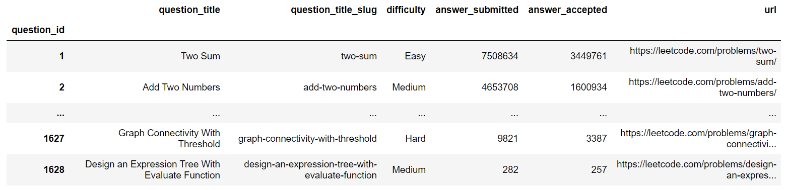

# [leetcode](https://leetcode.com/problemset/all/)

Repository containing Python solutions to LeetCode problems. The focal point of this project is to try to provide solutions as minimalist and as clean as possible. 

| # | Title | Solution | Difficulty |
|---| ----- | -------- | ---------- |
|1|[Two Sum](https://leetcode.com/problems/two-sum/)|[Python](solutions/1-two-sum.py)|Easy|
|2|[Add Two Numbers](https://leetcode.com/problems/add-two-numbers/)|[Python](solutions/2-add-two-numbers.py)|Medium|
|7|[Reverse Integer](https://leetcode.com/problems/reverse-integer/)|[Python](solutions/7-reverse-integer.py)|Easy|
|8|[String to Integer (atoi)](https://leetcode.com/problems/string-to-integer-atoi/)|[Python](solutions/8-string-to-integer-atoi.py)|Medium|
|9|[Palindrome Number](https://leetcode.com/problems/palindrome-number/)|[Python](solutions/9-palindrome-number.py)|Easy|
|13|[Roman to Integer](https://leetcode.com/problems/roman-to-integer/)|[Python](solutions/13-roman-to-integer.py)|Easy|
|14|[Longest Common Prefix](https://leetcode.com/problems/longest-common-prefix/)|[Python](solutions/14-longest-common-prefix.py)|Easy|
|36|[Valid Sudoku](https://leetcode.com/problems/valid-sudoku/)|[Python](solutions/36-valid-sudoku.py)|Medium|
|179|[Largest Number](https://leetcode.com/problems/largest-number/)|[Python](solutions/179-largest-number.py)|Medium|
|189|[Rotate Array](https://leetcode.com/problems/rotate-array/)|[Python](solutions/189-rotate-array.py)|Medium|
|279|[Perfect Squares](https://leetcode.com/problems/perfect-squares/)|[Python](solutions/279-perfect-squares.py)|Medium|
|347|[Top K Frequent Elements](https://leetcode.com/problems/top-k-frequent-elements/)|[Python](solutions/347-top-k-frequent-elements.py)|Medium|
|478|[Generate Random Point in a Circle](https://leetcode.com/problems/generate-random-point-in-a-circle/)|[Python](solutions/478-generate-random-point-in-a-circle.py)|Medium|
|509|[Fibonacci Number](https://leetcode.com/problems/fibonacci-number/)|[Python](solutions/509-fibonacci-number.py)|Easy|
|628|[Maximum Product of Three Numbers](https://leetcode.com/problems/maximum-product-of-three-numbers/)|[Python](solutions/628-maximum-product-of-three-numbers.py)|Easy|
|872|[Leaf-Similar Trees](https://leetcode.com/problems/leaf-similar-trees/)|[Python](solutions/872-leaf-similar-trees.py)|Easy|
|875|[Koko Eating Bananas](https://leetcode.com/problems/koko-eating-bananas/)|[Python](solutions/875-koko-eating-bananas.py)|Medium|
|957|[Prison Cells After N Days](https://leetcode.com/problems/prison-cells-after-n-days/)|[Python](solutions/957-prison-cells-after-n-days.py)|Medium|
|1304|[Find N Unique Integers Sum up to Zero](https://leetcode.com/problems/find-n-unique-integers-sum-up-to-zero/)|[Python](solutions/1304-find-n-unique-integers-sum-up-to-zero.py)|Easy|
|1366|[Rank Teams by Votes](https://leetcode.com/problems/rank-teams-by-votes/)|[Python](solutions/1366-rank-teams-by-votes.py)|Medium|
|1447|[Simplified Fractions](https://leetcode.com/problems/simplified-fractions/)|[Python](solutions/1447-simplified-fractions.py)|Medium|
|1456|[Maximum Number of Vowels in a Substring of Given Length](https://leetcode.com/problems/maximum-number-of-vowels-in-a-substring-of-given-length/)|[Python](solutions/1456-maximum-number-of-vowels-in-a-substring-of-given-length.py)|Medium|

## Dataframe & Git Automation

The python file [[automation.py]](automation.py) provides a simple way to automatise the generation of 'row' and folder/files to update the repository. For example, if the ids is set to [2, 13], the script will generate the files, the missing folders and output:

```
|2|[Add Two Numbers](https://leetcode.com/problems/add-two-numbers/)|[Python](./0000-0100/2-add-two-numbers.py)|Medium|
|13|[Roman to Integer](https://leetcode.com/problems/roman-to-integer/)|[Python](./0000-0100/13-roman-to-integer.py)|Easy|
```

The automation file also generate a dataframe that summarize all the existing Leetcode questions:


